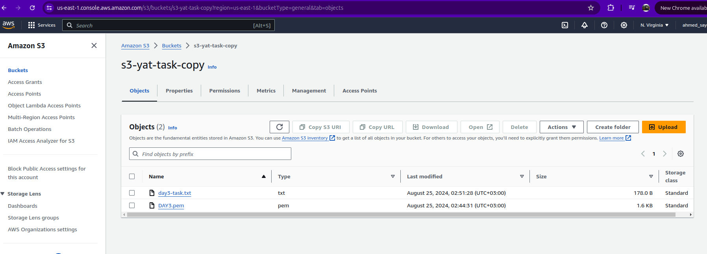

# AWS-Lambda-S3-DynamoDB-Integration
This repository provides a comprehensive guide on how to set up an AWS architecture that replicates files from one S3 bucket to another and stores the metadata in a DynamoDB table. The solution is triggered by an S3 event and executed using a Lambda function written in Python as shown in figure 1.

## Table of Contents

- [Introduction](#introduction)
- [Architecture Overview](#architecture-overview)
- [Setup Guide](#setup-guide)
  - [Step 1: Create an S3 Bucket](#step-1-create-an-s3-bucket)
  - [Step 2: Set Up DynamoDB](#step-2-set-up-dynamodb)
  - [Step 3: Create a Lambda Function](#step-3-create-a-lambda-function)
  - [Step 4: Configure Lambda Triggers](#step-4-configure-lambda-triggers)
- [Troubleshooting](#troubleshooting)
- [Conclusion](#conclusion)

## Introduction

This project aims to demonstrate the integration of AWS Lambda with S3 and DynamoDB. It includes the steps to create and configure these AWS services and explains how they interact to store and process data.

## Architecture Overview

The architecture consists of:

  - Source S3 Bucket: Stores the files that are initially uploaded.
  - Replica S3 Bucket: Receives the replicated files from the source bucket.
  - Lambda Function: Triggered by S3 events to copy files from the source bucket to the replica bucket and store metadata in DynamoDB.
  - DynamoDB Table: Stores metadata about the replicated files

  
   
  Figure 1: Architecture overview 

## Setup Guide

### Step 1: Create an S3 Bucket

1. **Navigate to S3**: Go to the AWS Management Console and select S3 from the services menu.
   
2. **Create a New Bucket**:
   - Click on "Create bucket."
   - Provide a unique bucket name .
   - Select the appropriate AWS region
   -  After the bucket is created, go to the "Permissions" tab of the bucket.
   - Click on "Bucket Policy" and paste the policy that in the [bucket-police.json](bucket-police.json) and replace the bucket name with your bucket name
   - **Note**: For production environments, consider tightening the security settings to allow access only from specific IAM roles or services.
   - **Note**: Create the reblica s3 with the same settings but with differant name 
### Step 2: Set Up DynamoDB

1. Navigate to DynamoDB: In the AWS Management Console, select DynamoDB from the services menu.
2. Create a New Table:
    - Click on "Create table."
    - Enter a table name.
    - Define a primary key (e.g., Name of type String).
    - for other settings use the defualt
    - **Note**: For production environments, consider tightening the settings to fit to your application
### Step 3: Create a Lambda Function

1. **Navigate to Lambda**:
   - In the AWS Management Console, select Lambda from the services menu.

2. **Create a New Function**:
   - Choose "Author from scratch."
   - Provide a function name.
   - Select the runtime (e.g., Python 3.12).
   - Set up the execution role:
     - If you don't have an existing role, create a new one with basic Lambda permissions.

3. **Write or Upload Code**:
   - Use the code provided in the [lambda_function.py](lamda-script.py) file in this repository.
   - Ensure the Lambda function code includes the necessary AWS SDK imports and handles the S3 and DynamoDB interactions.
   - The Lambda function uses the Boto3 library to interact with AWS services.
   - It copies the file from the source S3 bucket to the replica S3 bucket.
   - It stores metadata about the file in the DynamoDB table

4. **Environment Variables** (Optional):
   - You can add environment variables to store sensitive data like bucket names, DynamoDB table names, etc.

   
  Figure 2: Environment Variables 

5. **Permissions**:
   - Attach additional policies to the Lambda execution role to allow it to read from S3 and write to DynamoDB as shown in the figure 2.
   - **note**: in production make sure that you adjust the permissions to allow the lambda only to write to dynamodb and s3 and read from s3
   

  
   
  Figure 3: Lambda role 

### Step 4: Configure Lambda Triggers

1. **Add an S3 Trigger**:
   - Go to the Lambda function's "Triggers" tab.
   - Click on "Add trigger" and select S3.
   - Choose the bucket you created in Step 1 .
   - Configure the event type to trigger on `ObjectCreated` events.

2. **Test the Setup**:
   - Upload a file to the S3 bucket and observe if the Lambda function is triggered.
   - check the replica s3 to see if the file is stored correctly.
   - Check the DynamoDB table to see if the data is stored correctly.
   - You should observe actions similar to those shown in the figures 4,5 and 6.
   

  
   
  Figure 4: upload files to the main s3

  
   
  Figure 5: replicated to the replica s3

  
   
  Figure 6: Meta data stored in the dynamoDB table 

### Troubleshooting

when testing this errors can face you:
  - KeyError: 'Records': This error occurs when the Lambda function is triggered by an event that doesn’t have the expected structure. Ensure that the event source (S3) is correctly configured and that the Lambda function is designed to 
              handle the event structure.
  - NoSuchKey Error:
      This error typically indicates that the key (filename) you are trying to access in S3 doesn’t exist. Verify that the correct file name is being used and that the file exists in the S3 bucket.
  - ValidationException:
     Occurs when the item structure for DynamoDB is incorrect. Ensure all required attributes (like primary keys) are included in the item being written to DynamoDB.
### Conclusion
This project demonstrates how to integrate AWS Lambda, S3, and DynamoDB to create a serverless file replication and metadata storage solution. By following the steps in this guide, you can set up a similar architecture and adapt it to your specific use case.
